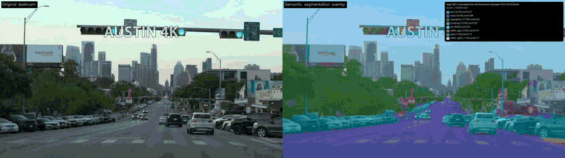

<p align="center">
  
</p>

<h1 align="center">SegCraft</h1>

<p align="center">
  <strong>Train, evaluate, and run semantic segmentation on images and video from one YAML config.</strong>
</p>

<p align="center">
  <a href="https://github.com/oney-erge/SegCraft-Semantic-Segmentation/actions/workflows/ci.yml"></a>
  <a href="https://pypi.org/project/segcraft/"></a>
  <a href="LICENSE.md"></a>
  
</p>

<p align="center">
  
</p>

SegCraft is a config-first semantic segmentation toolkit for training,
evaluating, and running image/video prediction from the same YAML setup. It is
alpha software, so the Python API and config schema can still change.

## Quick start

```bash
pip install "segcraft[web]"
segcraft-web          # then open http://127.0.0.1:8000
```

Upload a video or paste a YouTube URL, choose a preset, and download the
original, overlay, and side-by-side comparison videos. On an NVIDIA GPU, install
the CUDA build of PyTorch first (see [Install](#install)). With the default
`runtime.device: auto`, SegCraft falls back to the CPU when it finds no GPU.

From a checkout, `.\run.bat` (Windows), `./run.command` (macOS), or `./run.sh`
(Linux) sets up a pinned `uv`, builds the environment, and opens the app in your
browser.

## Why SegCraft

- **One config for the whole workflow.** Training, evaluation, and prediction
  read the same YAML, and configs merge in a fixed order: base, optional preset,
  optional local overrides.
- **Three model backends behind one interface.** Choose TorchVision,
  [segmentation-models-pytorch](https://github.com/qubvel-org/segmentation_models.pytorch),
  or Hugging Face SegFormer models by name in the config, with presets for
  Cityscapes, ADE20K, and PASCAL VOC.
- **Video in, video out.** Prediction writes `original.mp4`, `overlay.mp4`, and a
  side-by-side `comparison.mp4`, plus a `summary.json`.
- **Three ways to drive it.** Preset names work the same in the CLI, the Python
  API, and the web app, and `segcraft doctor` reports what Torch and CUDA can see.

## Install

From a checkout, use the same entry point on every platform. It installs a
pinned `uv`, creates the local environment, starts the web app, waits until it
is ready, and then opens it in your browser.

```powershell
.\run.bat
```

```bash
./run.command  # macOS
./run.sh       # Linux
```

Run `doctor`, intentionally rebuild the environment with `repair`, or use the
Docker path with the same launcher:

```bash
./run.sh doctor
./run.sh repair
./run.sh docker
./run.sh logs
./run.sh stop
```

Setup checks available disk space, prevents two installs from changing the
environment at the same time, and retries transient network failures up to
three times. A failed setup leaves details in `.setup/install.log`.

The PowerShell equivalents are `.\run.ps1 doctor` and `.\run.ps1 docker`.
Docker binds the UI only to `127.0.0.1:8000` and keeps outputs and model caches
in named volumes. An NVIDIA host can opt into GPU access with:

```bash
docker compose -f compose.yaml -f compose.nvidia.yaml up --build
```

For package-only use, install just the extras you need:

```bash
pip install "segcraft[torch]"                    # prediction/training with TorchVision
pip install "segcraft[torch,smp]"                # segmentation-models-pytorch
pip install "segcraft[torch,transformers]"       # Hugging Face segmentation models
pip install "segcraft[torch,transformers,video]" # video files and YouTube helpers
pip install "segcraft[web]"                      # FastAPI UI with video + default model backends
```

For development from a checkout:

```bash
uv sync --frozen --extra web --extra dev
```

For NVIDIA GPUs, install the CUDA-enabled PyTorch wheel that matches your
system from the PyTorch install page, then run:

```bash
segcraft doctor
```

`segcraft doctor` reports the Python executable, Torch version, CUDA build,
CUDA availability, and visible GPU names. If it reports `CUDA available: False`,
launch SegCraft from the environment where Torch can see CUDA, or keep
`runtime.device: auto` so SegCraft falls back to CPU instead of failing.

## CLI

```bash
segcraft validate
segcraft predict --preset cityscapes_video --local configs/local.yaml
segcraft train --preset fast_dev --local configs/local.yaml
segcraft evaluate --preset quality --local configs/local.yaml
```

`configs/local.yaml` is for machine-specific paths and is ignored by git.
Start from `configs/local.example.yaml`.

## Web App

```bash
segcraft-web
```

Open `http://127.0.0.1:8000`. The UI accepts either a video upload or a
YouTube URL, lets you choose a preset or type a custom preset path/name, shows
job progress, shows the active Torch/CUDA runtime, and exposes downloads for
the generated outputs.

## Notebooks

- `notebooks/01_quickstart.ipynb`: video prediction demo.
- `notebooks/02_config_and_api.ipynb`: config and API basics.
- `notebooks/03_web_app.ipynb`: launching the optional FastAPI app.

## Presets

SegCraft merges configs in this order:

1. `configs/base.yaml`
2. optional preset
3. optional local config

Preset names work in the CLI, Python API, and web app:

- `fast_dev`: tiny CPU training run.
- `quality`: longer training settings with scheduler and metrics.
- `binary_quickstart`: binary foreground/background setup.
- `pascal_video`: TorchVision PASCAL/VOC video prediction.
- `cityscapes_video`: SegFormer Cityscapes video prediction.
- `cpu_video_demo`: short Cityscapes CPU demo settings.
- `ade20k_video`: SegFormer ADE20K video prediction.
- `smp_unet_resnet34`: SMP Unet training setup.

`task.num_classes` controls trainable model heads. `task.class_names` only
controls display names; if labels are missing or do not match the model,
SegCraft falls back to `class_<id>` names during prediction.

## Python API

```python
from segcraft import load_config, load_config_object, list_available_presets
from segcraft.prediction import run_prediction

print(list_available_presets())

config = load_config("configs/base.yaml", preset_path="cityscapes_video")
typed = load_config_object("configs/base.yaml", preset_path="cityscapes_video")

events = []
summary = run_prediction(config, progress_callback=events.append)
```

## Outputs

Video prediction writes:

- `original.mp4`
- `overlay.mp4`
- `comparison.mp4`
- `summary.json`

Image-folder prediction writes masks, overlays, an optional overlay video, and
the same summary metadata.

## Development

```bash
pip install -e ".[web,dev]"
pytest
python -m build
twine check dist/*
```

Publishing uses `.github/workflows/release.yml` with GitHub trusted publishing.
Configure the PyPI/TestPyPI publisher for owner `oney-erge`, repository
`SegCraft-Semantic-Segmentation`, workflow `release.yml`, and environment
`pypi`. A `v*` tag publishes the package, container image, distribution files,
and GitHub release. A manual run can publish to TestPyPI without making a
release.
